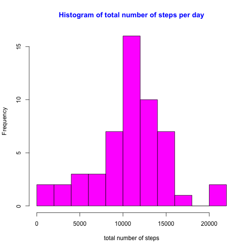
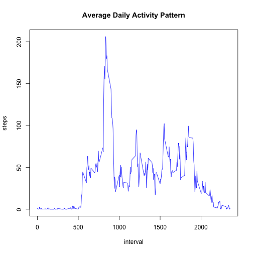
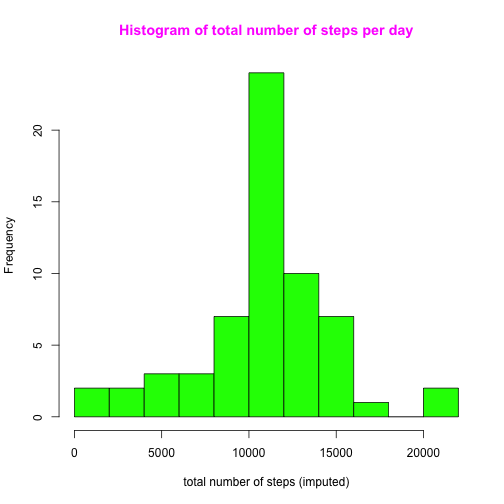
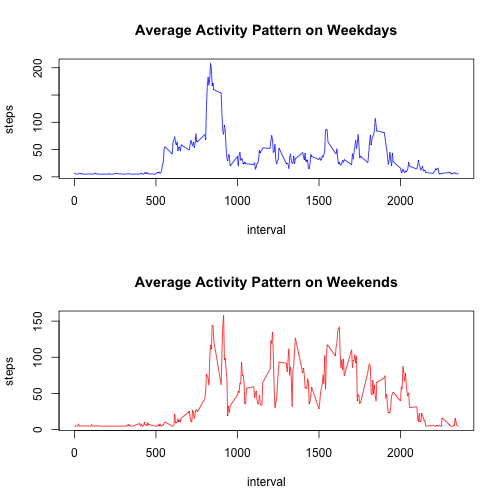

### We need to import the file and examine it in detail. We also need to upload the necessary libraries.

```r
url<-"https://d396qusza40orc.cloudfront.net/repdata%2Fdata%2Factivity.zip"
download.file(url=url, destfile="activity.zip")
unzip("activity.zip")
activity<-read.csv("activity.csv", na.strings = "NA")
head(activity)
```

```
##   steps       date interval
## 1    NA 2012-10-01        0
## 2    NA 2012-10-01        5
## 3    NA 2012-10-01       10
## 4    NA 2012-10-01       15
## 5    NA 2012-10-01       20
## 6    NA 2012-10-01       25
```

```r
dim(activity)
```

```
## [1] 17568     3
```

```r
str(activity)
```

```
## 'data.frame':	17568 obs. of  3 variables:
##  $ steps   : int  NA NA NA NA NA NA NA NA NA NA ...
##  $ date    : Factor w/ 61 levels "2012-10-01","2012-10-02",..: 1 1 1 1 1 1 1 1 1 1 ...
##  $ interval: int  0 5 10 15 20 25 30 35 40 45 ...
```

```r
library(dplyr)
```

```
## 
## Attaching package: 'dplyr'
```

```
## The following objects are masked from 'package:stats':
## 
##     filter, lag
```

```
## The following objects are masked from 'package:base':
## 
##     intersect, setdiff, setequal, union
```

### Let's transform the "date" variable into the appropriate "Date" format

```r
activity$date<-as.Date(activity$date, format="%Y-%m-%d")
diff.Date(range(activity$date))
```

```
## Time difference of 60 days
```

## What is the total number of steps taken per day?

1. Calucate the total number of steps taken per day

### We have to groups the data by date and calculate the mean of each group. 

```r
average_steps<-aggregate(activity$steps, list(activity$date), mean, na.omit=TRUE, simplify=TRUE)
names(average_steps)<-c("date", "average_steps")
head(average_steps)
```

```
##         date average_steps
## 1 2012-10-01            NA
## 2 2012-10-02       0.43750
## 3 2012-10-03      39.41667
## 4 2012-10-04      42.06944
## 5 2012-10-05      46.15972
## 6 2012-10-06      53.54167
```

2. Make a histogram of the total number of steps taken each day

### We will, first, calculate the total number of steps per day. Then, we will construct the histogram. 


```r
total_steps<-aggregate(activity$steps, list(activity$date), sum, na.remove=TRUE, simplify=TRUE)
names(total_steps)<-c("date", "total")
head(total_steps)
```

```
##         date total
## 1 2012-10-01    NA
## 2 2012-10-02   127
## 3 2012-10-03 11353
## 4 2012-10-04 12117
## 5 2012-10-05 13295
## 6 2012-10-06 15421
```

```r
hist(total_steps$total, breaks=15, col = "magenta", xlab= "total number of steps", main= "Histogram of total number of steps per day", col.main= "blue")
```



3. Calculate and report the mean and median of the total number of steps taken per day

### In step 2 (above), we have calculaed the "total_steps" taken for each day. Using this data, we will calculate the mean and median of the total number of steps. 


```r
head(total_steps)
```

```
##         date total
## 1 2012-10-01    NA
## 2 2012-10-02   127
## 3 2012-10-03 11353
## 4 2012-10-04 12117
## 5 2012-10-05 13295
## 6 2012-10-06 15421
```

```r
mean<- mean(total_steps$total, na.rm=TRUE)
mean
```

```
## [1] 10767.19
```

```r
median<-median(total_steps$total, na.rm=TRUE)
median
```

```
## [1] 10766
```

## What is the average daily activity pattern?
1. Make a time series plot (i.e. 𝚝𝚢𝚙𝚎 = "𝚕") of the 5-minute interval (x-axis) and the average number of steps taken, averaged across all days(y-axis)

### Let's calculate the average number of steps taken for each day on a 5-minute interval

```r
interval_steps<-aggregate(activity$steps, list(activity$interval), mean, na.rm=TRUE, simplify=TRUE)
names(interval_steps)<-c("interval", "steps")
head(interval_steps)
```

```
##   interval     steps
## 1        0 1.7169811
## 2        5 0.3396226
## 3       10 0.1320755
## 4       15 0.1509434
## 5       20 0.0754717
## 6       25 2.0943396
```

```r
dim(interval_steps)
```

```
## [1] 288   2
```

```r
with(interval_steps, plot(interval, steps, type="l", col="blue", main="Average Daily Activity Pattern"))
```



2. Which 5-minute interval, on average across all the days in the dataset, contains the maximum number of steps?

### We can filter the interval that has the maximum number of steps using the "filter" function

```r
filter(interval_steps, interval_steps$steps== max(interval_steps$steps))
```

```
##   interval    steps
## 1      835 206.1698
```

#### Our calculation indicate that tthe interval 835 has the maximum number of steps. This value agrees with what we see in the "Average Daily Activity Pattern" figure above.

## Imputing Missing Values

1. Calculate and report the total number of missing values in the dataset (i.e. the total number of rows with 𝙽𝙰s)

```r
sum (is.na(activity))
```

```
## [1] 2304
```

2. Devise a strategy for filling in all of the missing values in the dataset. The strategy does not need to be sophisticated. For example, you could use the mean/median for that day, or the mean for that 5-minute interval, etc.
### We will replace the missing values with the average across all groups because, in some instances, the values are missing for the enttire day. 

```r
activity$steps[is.na(activity$steps)] = mean(activity$steps, na.rm=TRUE)
```

3. Create a new dataset that is equal to the original dataset but with the missing data filled in.

### Using the imputation method described above, we will replace all missing values and creat a histogram witht the imputed data. 

```r
activity$steps[is.na(activity$steps)] = mean(activity$steps, na.rm=TRUE)
imputed_steps<-aggregate(activity$steps, list(activity$date), sum, na.remove=TRUE, simplify=TRUE)
names(imputed_steps)<-c("date", "total")
head(imputed_steps)
```

```
##         date    total
## 1 2012-10-01 10767.19
## 2 2012-10-02   127.00
## 3 2012-10-03 11353.00
## 4 2012-10-04 12117.00
## 5 2012-10-05 13295.00
## 6 2012-10-06 15421.00
```

```r
hist(imputed_steps$total, breaks=15, col = "green", xlab= "total number of steps (imputed)", main= "Histogram of total number of steps per day", col.main= "magenta")
```


## Are there differences in activity patterns between weekdays and weekends?
1. Create a new factor variable in the dataset with two levels – “weekday” and “weekend” indicating whether a given date is a weekday or weekend day.

### Let's create a new variable that has a new column (day) that indicates the weekday for each value of the "date" variable


```r
wk_wd <- mutate(activity, days=ifelse (weekdays(activity$date) %in% c("Monday", "Tuesday", "Wednesday", "Thursday", "Friday"), "weekday", "weekend"))
head(wk_wd)
```

```
##     steps       date interval    days
## 1 37.3826 2012-10-01        0 weekday
## 2 37.3826 2012-10-01        5 weekday
## 3 37.3826 2012-10-01       10 weekday
## 4 37.3826 2012-10-01       15 weekday
## 5 37.3826 2012-10-01       20 weekday
## 6 37.3826 2012-10-01       25 weekday
```

```r
dim(wk_wd)
```

```
## [1] 17568     4
```

2. Make a panel plot containing a time series plot (i.e. 𝚝𝚢𝚙𝚎 = "𝚕") of the 5-minute interval (x-axis) and the average number of steps taken, averaged across all weekday days or weekend days (y-axis). 

### We will, now, filter the weekdays and weekends from the "wk_wd" dataset and plot the average numbers of steps for each set


```r
par(mfrow=c(2,1))
interval_wk_wd<-aggregate(wk_wd$steps, list(wk_wd$interval, wk_wd$days), mean, na.rm=TRUE, simplify=TRUE)
names(interval_wk_wd)<-c("interval", "days", "steps")
head(interval_wk_wd)
```

```
##   interval    days    steps
## 1        0 weekday 7.006569
## 2        5 weekday 5.384347
## 3       10 weekday 5.139902
## 4       15 weekday 5.162124
## 5       20 weekday 5.073235
## 6       25 weekday 6.295458
```

```r
dim(interval_wk_wd)
```

```
## [1] 576   3
```

```r
weekdays<-filter(interval_wk_wd, days=="weekday")
weekend<-filter(interval_wk_wd, days=="weekend")
with(weekdays, plot(interval, steps, type="l", col="blue", main="Average Activity Pattern on Weekdays"))
with(weekend, plot(interval, steps, type="l", col="red", main="Average Activity Pattern on Weekends"))
```


